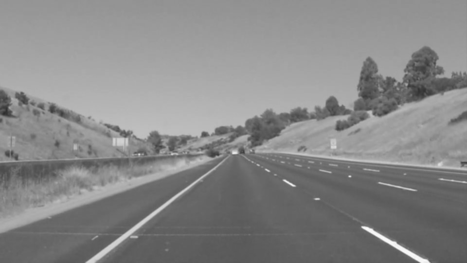

#**Finding Lane Lines**
#### By _[**Satchel Grant**](https://github.com/grantsrb)_

The goal of this project was to make a pipeline that finds lane lines on the road and draws their projections onto the image using a Jupyter notebook environment.

---

### Reflection

####1. Pipeline Description

This pipeline broadly involves 5 steps. First, the image is converted to grayscale and slightly blurred using the GaussianBlur function from openCV. The grayscale is not required for the next step but it helps consolidate edge gradients and is necessary for the Hough Transform. The GaussianBlur smooths out noise. This prepares the image for gradient detection using openCV's Canny edge detection function.

_Grayscale_

_Grayscale with Gaussian Blur_

The pipeline then uses openCV's Canny edge detection to find pixel changes above and between a custom threshold. Pixel gradients between the low and high threshold values are recorded as weak edges. Pixel gradients above the high threshold are recorded as strong edges. These edges are later used to define the location of the lane lines. This pipeline's thresholds were set through trial and error.

_Canny Edges_

The edge detection step detects far more edges than those of the lane lines. In order to focus on the lane edges, the pipeline partitions the image into three locations: the general location of the left lane, right lane, and everything else. Using openCV's fillPoly function the pipeline creates two mirrored trapezoids on the image, one for the left lane line and one for the right. These trapezoids are used to with numpy broadcasting to select edges from each lane without selecting edges from the rest of the image. The trapezoids factor in the hood of the car. Each lane's edges are kept separate from one another to assist in drawing a single lane projection in a later step.

_Left Partition_

_Right Partition_

Using the partitioned edges, the pipeline uses openCV's HoughLinesP function to run a Hough transform. The transform returns lines that are common to a group of linearly placed pixels by finding graph crossings in Hough space (or parameter space). Each of the parameters is used to tune the precision of the line matching. The parameters were set so that lines would connect at least 30 edge pixels (vote_threshold = 30), have 2 or fewer pixels of seperation in the edge (max_pixel_gap = 2), and be at least 5 pixels long on the image (min_line_length = 5). The vote_threshold and max_pixel_gap were set high enough to remove random lines created from noise and small foreign obstacles while retaining detection of the edges from the lane lines within a certain distance. The pixel and angle resolution were determined by trial and error.

_Hough Lines_

The final step is the creation of a line to sit on top of the lane in the image. For each the left and right lane, the pipeline does creates a directional vector from the weighted average direction of each line above a specified slope. The size of the directional contribution was intentionally unnormalized under the theory that lane lines will frequently have large solid lines from the Hough transform. The pipeline also finds the average x and y coordinates from all of the lines generated in the Hough transform. The final line is constructed by extending the directional vector from the averaged point to the top and bottom of the individual lane's trapezoidal space.

_Final Image_

###2. Shortcomings and Solutions

One large shortcoming of this pipeline is in its evaluation of shadows. This is apparent in the extra.mp4 video. Shadows are detected in the Canny edge detection and can be detected in the Hough transform which can affect the average direction of the constructed lane line. This could likely be improved by giving extra weight to Hough lines that overlay pixels of white and yellow color. Another potential improvement could be to include the previous frame's lane line in the average directional vector. This approach could additionally help stabilize the lane line. The final proposed solution would be to optimize straight edge detection in the Hough Transform. This final solution, however, would provide little benefit in cases of straight shadows.

Another shortcoming is the detection of random objects near the lane lines. Although it may be helpful to an autonomous vehicle to detect random objects in the road, it is best to keep detection of lanes seperate from detection of random objects. Excluding object detection is a similar problem to that of the shadows. It can likely be solved in the same ways.

One final shortcoming is the instability of the drawn lane line. The lines are clearly shakey which is due in part to the new series of calculations at every frame of the video. The most effective solution, given this pipeline's approach, would likely be to include the the previous frame's drawn lane line in the average directional vector.

